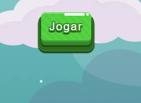

# Teste tecnico 2 Escribo

##### - Instrução
  - implemente a parte lógica e a interface do jogo indiano "Cobras e escadas".
  
  

Requisito para executar:
  - Baixe o zip deste repositório ou execute a seguinte instrução em um reposiório já criado:
    ```sh
    git clone <repositorio remoto>
    ```

Como utilizar:

- execute o arquivo <b>index.html</b>
- click no botão <b>jogar</b>

  
